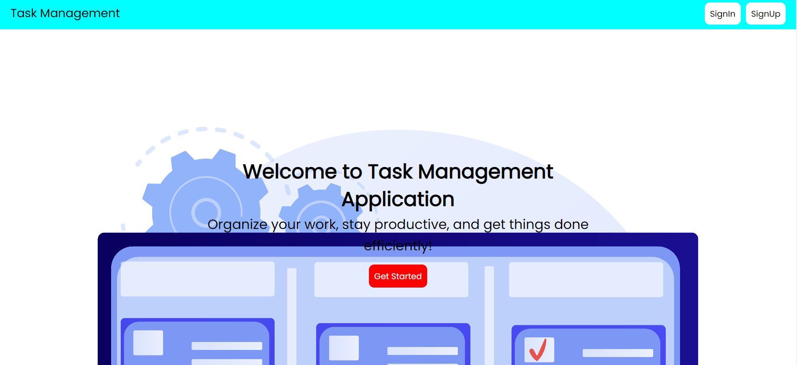
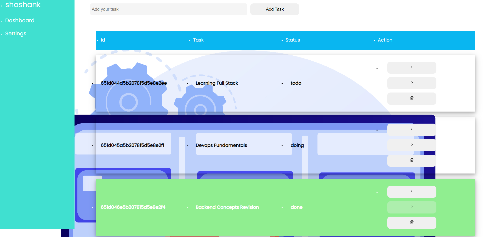
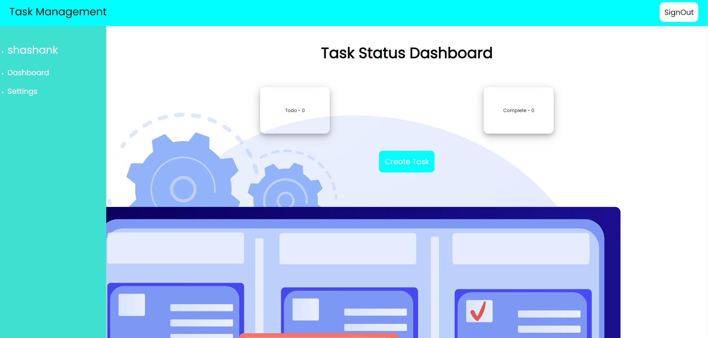

# TaskManagement
Pilot Project - Task Management Application using Mern Stack

# Task Management Application

Welcome to the Task Management Application, a full-stack web application built with the MERN stack (MongoDB, Express, React, Node.js). This application allows users to manage tasks, stay organized, and be more productive.







## Overview

This project consists of three main components:

- **Client**: The client-side of the application, responsible for the user interface and interactions.
- **Database**: Handles data storage and retrieval using MongoDB as the database.
- **Server**: Manages API requests, business logic, and database communication.

## Getting Started

To run this application locally, follow these steps:

1. Clone this repository to your local machine:

   ```bash
   git clone https://github.com/KiranD0721/TaskManagement.git


Change directory to the project root:
cd TaskManagement

Install the required dependencies for both the client and server:
cd client
npm install
cd ../server
npm install


##Start the Server using 
npm run dev 
npm run-all to be saved inside the scripts of the server.js

-----or------
Start the client and server:
# Start the client (in the 'client' directory)
cd client
npm start

# Start the server (in the 'server' directory)
cd ../server
npm start

---------FEATURES----------------
Features
User Authentication: Sign up and sign in securely to manage your tasks.
Task Management: Add, edit, delete, and update the status of your tasks.
Intuitive UI: A user-friendly interface for efficient task management.
Responsive Design: Accessible on both desktop and mobile devices.
Technologies Used
Client:
React
Redux
Axios
CSS Modules
Database:
MongoDB
Server:
Node.js
Express.js
Mongoose (MongoDB ORM)
Authentication:
JSON Web Tokens (JWT)
Bcrypt for password hashing


---------FOLDER STRUCTURE----------------

Folder Structure
The project is organized into the following directories:

client: Contains the client-side React application.
database: Manages the MongoDB database schema and models.
server: Houses the Express.js server and API routes.


--------CLIENT----------------


Client
The client-side application is built using React and Redux for state management. The main client directory structure includes:

src: Contains the source code for the React application.
components: Reusable React components.
pages: Main application pages (Home, Dashboard, etc.).
redux: Redux actions, reducers, and store setup.
...

---------DATABASE----------------

Database
The database component uses MongoDB for data storage. It includes:

MongoDB models for User and Task data.
Database connection setup in the server.
Schema and models for database collections.


---------SERVER----------------


Server
The server handles API requests, user authentication, and business logic. It includes:

Express.js routes for authentication and task management.
User authentication using JSON Web Tokens (JWT).
Task CRUD operations with MongoDB.
...

---------CONTRIBUTIONS----------------

Contributing
Contributions to this project are welcome! If you'd like to contribute, please follow our Contribution Guidelines.


Feel free to customize this template by replacing placeholders with specific details about your project. Additionally, you can add or modify sections to better describe your application and its features. Once you're satisfied with the content, copy and paste it into your GitHub README editor.


   
